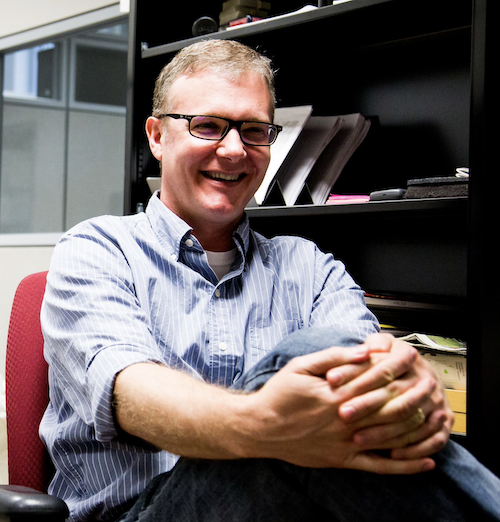

# OSG David Swanson Award

{ align=right }

The OSG David Swanson Award was established to honor our late colleague, David Swanson. David contributed to campus research across the country, through the advancement of distributed high-throughput computing (dHTC) and OSG.

“David was the founding director of [the Holland Computing Center](https://hcc.unl.edu/) at [the University of Nebraska–Lincoln](https://www.unl.edu/) and a tireless advocate for [OSG](https://osg-htc.org/),” said Brian Bockelman, who David mentored.  “Through his leadership, Nebraska went from simple ‘users’ of OSG to having team members become part of OSG management.  David himself ultimately went on to become the OSG Council Chair in 2016 and helped steer OSG through his calm, steady influence. Beyond his formal appointments, he was a close friend and mentor to many in the OSG community and always available to provide well-needed insight and thoughts to others.”

David passed away in an accident in fall 2019. In his memory the award is bestowed annually upon one or more former students of the OSG User School who have subsequently achieved significant dHTC-enabled research outcomes, and covers the recipient’s costs of attending the Throughput Computing Week to present their work.

## Award Recipients
*   **Brandi Pessman**, University of Nebraska—Lincoln &mdash;
    awarded and [presented](https://path-cc.io/presentations/2025/06/02/david-swanson-awardee-presentation/) in 2025
*   **Cort Posnansky**, Penn State &mdash;
    awarded and [presented](https://agenda.hep.wisc.edu/event/2175/contributions/31164/) in 2024
*   **Jimena González**, University of Wisconsin—Madison &mdash;
    awarded and [presented](https://agenda.hep.wisc.edu/event/2014/contributions/28463/) in 2023
*   **Aashish Tripathee**, University of Michigan &mdash;
    awarded and [presented](https://agenda.hep.wisc.edu/event/2014/contributions/28462/) in 2023
*   **Connor Natzke**, Colorado School of Mines &mdash;
    awarded and [presented](https://indico.fnal.gov/event/53029/contributions/236143/) in 2022
*   **Nicholas Cooley**, University of Pittsburgh &mdash;
    awarded and [presented](https://indico.fnal.gov/event/47040/contributions/208348/) in 2021
*   **Zhonggang (John) Li**, University of Wisconsin–Madison &mdash;
    awarded in 2020 and [presented](https://indico.fnal.gov/event/47040/contributions/208347/) in 2021
*   **Anirvan Shukla**, University of Hawaiʻi at Mānoa &mdash;
    awarded and [presented](https://indico.fnal.gov/event/22127/contributions/194478/) in 2020

Note: In March 2021, two David Swanson Award winners presented: John Li, a 2020 award recipient, who was unavailable to speak when the All-Hands Meeting was rescheduled from March to September 2020 due to the pandemic, and the 2021 recipient, Nicholas Cooley.

Brandi Pessman, the 2025 recipient of the David Swanson award, from the University of Nebraska—Lincoln, attended the OSG User School in 2024.

Cort Posnansky, the 2024 recipient of the David Swanson award,

Jimena González, one of two recipients of the David Swanson award in 2023, is a Ph.D. student from the University of Wisconsin—Madison, in the Department of Physics. In her research, she uses machine learning to search Dark Energy Survey cosmology data for evidence of strong gravitational lensing, in order to better understand the nature of dark energy. Before finding the OSG, this was a slow process—she estimated it would take five or six years to find the images of interest after the model was trained. After attending the OSG User School in 2021, she was able to apply dHTC to her research and cut down the processing time to a matter of days. She [spoke about](https://agenda.hep.wisc.edu/event/2014/contributions/28463/) her research at HTC23.

Aashish Tripathee, one of two recipients of the David Swanson award in 2023, 

Connor Natzke, the 2022 David Swanson Award recipient, was a Ph.D. student from Colorado School of Mines who attended the 2019 OSG School. He almost immediately applied the lessons learned from the School to an OSG Access Point for his research in nuclear structure. Connor [spoke about](https://indico.fnal.gov/event/53029/contributions/236143/) using high throughput computing to decrease the time required for mapping data correction factors for a gamma-ray detector array. This 6-month simulation campaign used over 15 years of computing time.

Nick Cooley, 2021 recipient of the David Swanson Award, attended the OSG User School in 2018. Since that time, Nick and his group at the University of Pittsburgh have undertaken a number of projects benefiting from dHTC and OSG capabilities, with more than 2 million hours of compute usage on the Open Science Pool in the last year. Nick discussed [his work](https://indico.fnal.gov/event/47040/contributions/208348/) in computational biology on OSG. 

John Li, of the University of Wisconsin–Madison. attended the OSG User School in 2019 and quickly accelerated in his use of high throughput computing, whether running via a campus access point or on the Open Science Pool via an OSG Connect access point. John spoke about [his work](https://indico.fnal.gov/event/47040/contributions/208347/) using data mining in genomics by high-throughput computing and noted that high-throughput computing saves significant computation time and projects that would have taken 2–3 years were completed in 1–2 weeks.

Anirvan Shukla, a 2020 award recipient and 2016 User School participant, was a graduate student in the Department of Physics, University of Hawaiʻi at Mānoa and at the September 2020 All-Hands Meeting spoke about [“Antimatter: Using High Throughput Computing to Study Very Rare Processes.”](https://indico.fnal.gov/event/22127/contributions/194478/)
